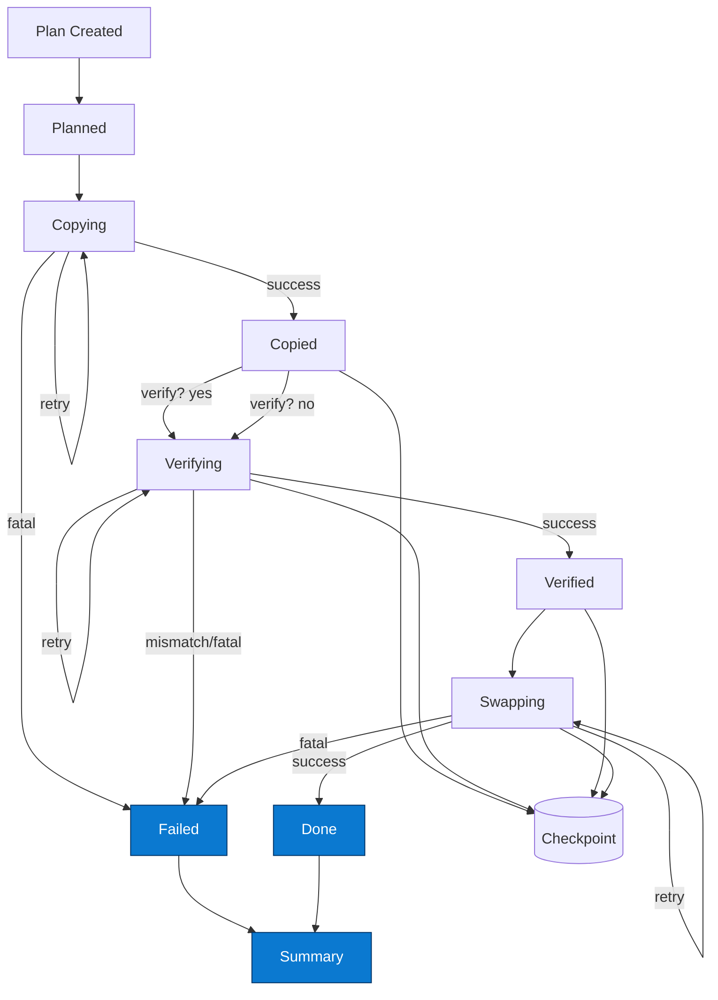
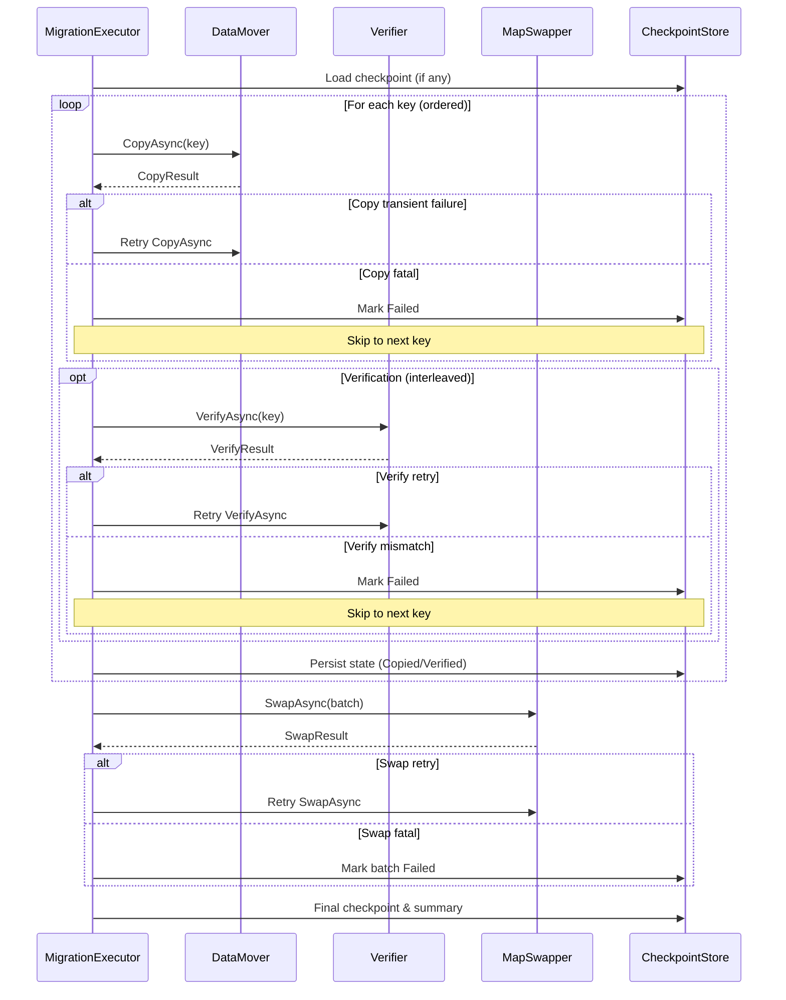

# Shardis Migration Usage Guide

This guide shows how to register and execute a key migration using the in-memory reference components introduced in ADR 0002. It is intended for experimentation, tests, and as a template for production adapters.

> Production note: Replace the in-memory mover, checkpoint store, and (optionally) verification strategy with durable/provider-specific implementations before migrating real data.

## Overview

A migration moves keys whose target shard changes between two topology snapshots. The executor processes an ordered plan of `KeyMove` items with deterministic state transitions:

Planned → Copying → Copied → Verifying → Verified → Swapping → Done | Failed

Progress is observable via metrics and an optional `IProgress<MigrationProgressEvent>` stream.

### Obtaining Topology Snapshots in Practice

In the sample we construct `TopologySnapshot` objects in-memory. In production you derive them from the authoritative shard map store. For millions of keys you must (1) obtain a logically consistent view, (2) derive the target assignments, and (3) feed the planner without materializing unnecessary data.

Sources of truth (examples):

* Redis / SQL shard map table (key -> shardId)
* Domain catalog service exposing a paged API of key assignments
* Event log (append-only) of assignments with a monotonic version

Consistency strategies:

| Strategy | How | Trade-offs |
|----------|-----|-----------|
| Point-in-time snapshot (versioned table) | SELECT * WHERE version <= V | Requires versioning column / MVCC |
| Scan with high-water mark | Read current max version; stream increments until caught up | Slightly longer acquisition time |
| Brief assignment freeze | Temporarily disable new assignments during snapshot | Operational pause window |

Building `from` snapshot (pseudo-code):

```csharp
// Example: SQL source with (Key TEXT, ShardId TEXT, Version BIGINT)
await foreach (var row in store.EnumerateAssignmentsAsync(cutoffVersion, ct))
{
    fromAssignments[new ShardKey<string>(row.Key)] = new ShardId(row.ShardId);
}
var fromSnapshot = new TopologySnapshot<string>(fromAssignments);
```

Deriving the `to` snapshot:

1. Decide target topology (add/remove shards, adjust weights / virtual nodes).
2. Recompute each key's target shard via routing rule (e.g., consistent hash ring built with new shard set) OR apply balancing heuristic (e.g., greedy fill by size / load estimate).
3. Only store differing assignments. (You can still construct a full `TopologySnapshot`; the planner will diff; future segmented planner will allow streaming.)

Avoid full materialization when key count is very large:

* Stream keys and yield moves on-the-fly (segmented / streaming planner; see ADR-0004).
* Persist intermediate segment checkpoints to bound memory.
* Use range or hash partition batches (e.g., process keys whose hash prefix == `00`..`0F` first) for phased migration windows.

Verification at scale:

| Mode | When to use | Notes |
|------|-------------|-------|
| Full equality | Small/medium data, strong assurance | Higher IO cost |
| Hash (stable) | Large datasets | Pre-compute or mover emits hash to avoid re-read |
| Sampled + escalating | Tight SLA windows | Start with sample, escalate mismatches to full |

Memory considerations:

* Each `KeyMove` struct/value adds overhead; millions of moves can consume significant memory.
* Use 64-bit process & monitor allocations if building entire plan.
* Roadmap: segmented planner reduces resident size by processing slices (see migration rationale & ADR references).

Operational sequence (large migration):

1. Snapshot current assignments (record snapshot version).
2. Define target shard set & weights.
3. Dry-run plan: compute high-level counts (#moves per shard pair) without executing.
4. Capacity check: ensure target shards have headroom for incoming data segment by segment.
5. Execute migration with conservative concurrency; observe metrics; adjust.
6. Post-verify sample of stable keys to confirm no silent corruption.
7. Decommission obsolete shards only after verification window passes.

This section clarifies that the sample's in-memory construction is illustrative—production code must integrate with your map store and may require streaming planners for scale.

For background on why a formal migration mechanism exists and its invariants, see `migration-rationale.md`.

### Key Migration & Data Mover Semantics

The migration executor orchestrates per-key state transitions; the `IShardDataMover<TKey>` is a narrowly scoped collaborator responsible **only** for moving bytes/entities for a single key from its source shard to its target shard (and any provider-specific staging needed to enable verification).

Semantic coupling boundaries:

| Concern | Migration Executor | Data Mover |
|---------|--------------------|------------|
| Plan ordering / which keys | Decides based on `MigrationPlan` | Not aware |
| Concurrency policy | Applies copy/verify semaphores | Not aware (must be thread-safe) |
| Copy operation | Invokes | Implements idempotent `CopyAsync` |
| Verification decision | Orchestrates (may call a separate verification strategy) | May optionally prep data (e.g., materialized projection) but does not assert success/failure unless unrecoverable |
| Retry classification | Interprets thrown exceptions (transient vs fatal) | Surfaces domain-specific exceptions (e.g., `SourceMissingException`) |
| State transitions | Owns state machine & checkpoint persistence | Stateless aside from transient local buffers |
| Swap (map mutation) | Invokes `IShardMapSwapper` after verification | Never mutates shard map |
| Metrics emission | Emits counters/gauges exactly once per transition | Should not emit migration metrics directly |
| Logging | Coordinates structured, redacted logs per key | Emits minimal contextual logs (no full key values) |

Key invariants enforced at the seam:

1. `CopyAsync` MUST be idempotent: rerunning after a partial / previous successful copy leaves target in an equivalent state.
2. `CopyAsync` MUST NOT perform shard map updates or finalize visibility; authoritative routing only changes during Swap.
3. Data Mover SHOULD throw a clearly distinguishable exception type for permanent (fatal) conditions vs transient ones (timeout, network) so the executor can apply retries only where safe.
4. Data Mover MUST NOT perform verification side-effects (e.g., marking success) – it only prepares data; the executor (optionally with a verification strategy) transitions to `Verified`.
5. No randomness without a fixed seed: repeated runs under identical inputs yield the same target representation (supports verification hash/equality).

Recommended exception taxonomy (example – adapt to project):

```csharp
// Transient (retry eligible)
class ShardDataTransientException : Exception { /* network, timeout */ }

// Permanent (fatal – mark Failed)
class ShardDataPermanentException : Exception { /* source missing, schema mismatch */ }
```

Execution interplay summary:

1. Executor selects next Planned key (ordering from plan).
2. Invokes `CopyAsync`; classifies outcome (success → `Copied`, retry, or `Failed`).
3. (Interleaved) Invokes verification strategy (which may rely on artifacts produced by the mover – e.g., pre-computed hash, projection snapshot).
4. After verification success, key awaits batch Swap; Data Mover is no longer engaged for that key.
5. On resume (after checkpoint), executor will not re-invoke `CopyAsync` for keys already beyond `Copied` unless verification requires re-copy (future extension); idempotency allows safe duplication if it occurs.

This design keeps the coupling **semantic** (shared understanding of state boundaries & idempotency) while avoiding structural coupling (Data Mover has no knowledge of plan, checkpointing, or swapping). The executor can thus substitute movers (EF, Marten, SQL) without altering migration orchestration logic.

### Execution Flow (High-Level)



### Data Movement & Verification Sequence



### Interpretation

The flowchart captures the per-key state machine; the sequence diagram shows the interplay between executor and abstractions. Checkpoints are persisted after significant transitions to ensure idempotent resume. Interleaving allows verification to overlap copy operations improving throughput while respecting configured concurrency.

Consult ADR 0002 for the formal invariants governing these diagrams.

## 1. Service Registration

Register Shardis core + migration services. The generic key type (e.g. `string`, `Guid`, `long`) must match your application key type.

```csharp
var services = new ServiceCollection();

// Core Shardis (assumes an extension exists; adjust as needed)
services.AddShardis<string>();

// Migration (in-memory defaults). Customize options if desired.
services.AddShardisMigration<string>(opt =>
{
    opt.CopyConcurrency = 64;      // increase parallel copy
    opt.VerifyConcurrency = 32;    // keep verification moderate
    opt.SwapBatchSize = 1000;      // larger batches reduce swap overhead
    opt.MaxRetries = 5;
    opt.RetryBaseDelay = TimeSpan.FromMilliseconds(100);
    opt.InterleaveCopyAndVerify = true; // overlap phases for throughput
});

var provider = services.BuildServiceProvider();
```

## 2. Planning a Migration

Obtain current ("from") and desired ("to") topology snapshots. The planner produces a deterministic ordered list of key moves.

```csharp
var planner = provider.GetRequiredService<IShardMigrationPlanner<string>>();

TopologySnapshot from = /* acquire current snapshot from map store */;
TopologySnapshot to   = /* construct new snapshot after scaling */;

CancellationToken ct = CancellationToken.None;

MigrationPlan plan = await planner.CreatePlanAsync(from, to, ct);
Console.WriteLine($"Plan {plan.PlanId} with {plan.Moves.Count} key moves created.");
```

## 3. Executing the Plan

Resolve the executor from DI, optionally supply a progress observer.

```csharp
var executor = provider.GetRequiredService<ShardMigrationExecutor<string>>();

var progress = new Progress<MigrationProgressEvent>(p =>
{
    Console.WriteLine($"[{p.TimestampUtc:O}] copied={p.Copied} verified={p.Verified} swapped={p.Swapped} failed={p.Failed} activeCopy={p.ActiveCopy} activeVerify={p.ActiveVerify}");
});

MigrationSummary summary = await executor.ExecuteAsync(plan, progress, ct);
Console.WriteLine($"Migration {summary.PlanId} done={summary.Done} failed={summary.Failed} elapsed={summary.Elapsed}.");
```

### Cancellation & Resume

If the process is cancelled, a checkpoint is flushed. Re-running `ExecuteAsync` with the same plan resumes without duplicating work (idempotent transitions). Always persist or reconstruct the same `MigrationPlan` (same `PlanId`) when resuming.

## 4. Metrics

`IShardMigrationMetrics` is resolved via DI (no-op by default). Provide a concrete implementation to export counters/gauges to your telemetry system.

Counters expected:

* Planned
* Copied
* Verified
* Swapped
* Failed
* Retries

Gauges:

* ActiveCopy
* ActiveVerify

Ensure metric increments occur once per key (the executor enforces this before calling the metrics API).

Durations (milliseconds) you can export by extending `IShardMigrationMetrics`:

* Copy duration per key (`ObserveCopyDuration`)
* Verify duration per key (`ObserveVerifyDuration`)
* Swap batch duration (`ObserveSwapBatchDuration`)
* Total elapsed per plan (`ObserveTotalElapsed`)

## 5. Replacing In-Memory Components

For production you should override the default registrations before calling `AddShardisMigration` or by registering your implementations first. An experimental SQL implementation (`Shardis.Migration.Sql`) provides a starting point for durable checkpoint + shard map storage (preview – review source before adopting):

```csharp
services.AddSingleton<IShardDataMover<string>, MyDurableDataMover>();
services.AddSingleton<IShardMigrationCheckpointStore<string>, PostgresCheckpointStore>();
services.AddSingleton<IShardMapSwapper<string>, MyAtomicMapSwapper>();
services.AddSingleton<IVerificationStrategy<string>, HashSampleVerificationStrategy<string>>();
services.AddSingleton<IShardMigrationMetrics, PrometheusMigrationMetrics>();

services.AddShardisMigration<string>(); // keeps existing ones, adds any missing
```

Guidelines:

* Data mover must be idempotent for repeated `CopyAsync` on already-copied keys.
* Checkpoint store must provide atomic replace semantics (no partial writes of state dictionary).
* Swapper must guarantee all-or-nothing per batch; if not natively supported, implement compensation.
* Verification strategy should be deterministic; avoid randomness in sample selection without a fixed seed.

## 6. Configuration Reference

| Option | Default | Description |
| ------ | ------- | ----------- |
| CopyConcurrency | 32 | Parallel copy operations. Higher values increase throughput but pressure source. |
| VerifyConcurrency | 32 | Parallel verification operations; often lower than copy to reduce target read load. |
| SwapBatchSize | 500 | Keys swapped atomically per batch. Larger batches reduce overhead but increase rollback scope. |
| MaxRetries | 5 | Transient retry attempts before marking Failed. |
| RetryBaseDelay | 100 ms | Base delay for exponential backoff (delay * 2^attempt). |
| InterleaveCopyAndVerify | true | Whether to start verifying as soon as keys are copied (overlap phases). |
| EnableDryRunHashSampling | true | Placeholder hook for future partial verification modes. |
| ForceSwapOnVerificationFailure | false | If true, still swaps keys that failed verification (unsafe, for emergency). |
| CheckpointFlushInterval | 2 s | Time-based flush cadence for checkpoint persistence. |
| CheckpointFlushEveryTransitions | 1000 | Transition count threshold triggering a checkpoint flush. |

## 7. Logging & Redaction

Never log full key values. If logging is required, truncate or hash keys (e.g., first 6 bytes of a hash). Shard identifiers may also be redacted if considered sensitive.

## 8. Failure Semantics

* Transient copy/verify errors (network, timeout) ⇒ retried with capped exponential backoff.
* Persistent verification mismatch ⇒ key marked Failed unless `ForceSwapOnVerificationFailure` is set.
* Swap batch failure ⇒ retried; if unrecoverable, batch rolled back (implementation responsibility) and keys remain Copied or mark Failed.

## 9. Benchmarks

See `docs/benchmarks.md` (migration category) for measuring keys/sec under varying concurrency. Use env vars `SHARDIS_FULL` and `SHARDIS_BENCH_MODE` to scale matrix and rigor.

## 10. Cross References

* ADR 0001 (Core Architecture): `docs/adr/0001-core-architecture.md`
* ADR 0002 (Migration Execution): `docs/adr/0002-key-migration-execution.md`

## 11. Next Steps / Extensibility Ideas

* Durable checkpoint store (e.g., PostgreSQL / Redis) with optimistic concurrency.
* Segmented / streaming plan execution for very large keyspaces.
* Adaptive concurrency controller based on observed latencies.
* Additional verification strategies (Bloom filter pre-check, probabilistic sampling with fixed seed).

## 12. Segmented Enumeration Planner (Large Keyspaces)

For very large key counts (hundreds of thousands to millions) constructing a full in-memory "from" snapshot can double memory usage (source snapshot + plan + executor state). The segmented enumeration planner removes that requirement by streaming the authoritative assignments directly from an `IShardMapEnumerationStore<TKey>`.

When to use:

* Key count is large enough that a full `TopologySnapshot` of current assignments is expensive (memory / GC pressure).
* You already have an enumeration-capable store (SQL table scan, paged API, etc.).
* Target snapshot can be produced more cheaply (e.g., computed assignments or only changed assignments already known).

Registration:

```csharp
services
    .AddShardisMigration<string>(o =>
    {
        o.CopyConcurrency = 128;
        o.VerifyConcurrency = 64;
    })
    .UseSegmentedEnumerationPlanner<string>(segmentSize: 20_000); // stream in 20k chunks
```

Guidelines:

* Choose `segmentSize` to balance working set vs CPU overhead. Typical: 5k – 50k.
* The planner still materializes the target snapshot; consider computing only differing assignments if feasible.
* Cancellation is observed between segments; long-running enumerations should yield promptly.
* Ordering of resulting moves stays deterministic (Source, Target, StableKeyHash) matching the in-memory planner, so downstream behavior (checkpointing, metrics) is unchanged.
* Use `TopologyValidator.ValidateAsync` prior to planning to ensure no duplicate keys exist (defensive check for data corruption).
* Capture a topology hash (`TopologyValidator.ComputeHashAsync`) before and after planning to detect drift if a long window exists between plan creation and execution.

Limitations:

* Does not reduce target snapshot memory; future work may add a fully streaming diff that also streams target computation.
* Requires a single pass full enumeration; if your store cannot provide a stable snapshot (e.g., concurrent rewrites without versioning) you must apply a consistency strategy (see earlier section).

Benchmarks: see `SegmentedPlannerBenchmarks` (add `--filter *SegmentedPlannerBenchmarks*`). The memory column should show reduced allocations compared to the in-memory planner for large key counts when the source snapshot would otherwise be materialized separately.

---

If anything here is unclear or you require an additional adapter sample, open an issue referencing this guide.
